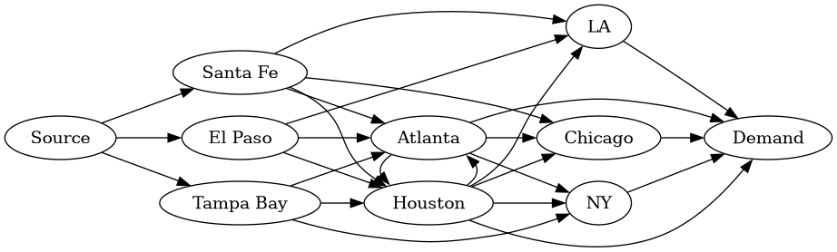

``` python
import numpy as np
from scipy.optimize import linprog
from math import inf
from itertools import product

warehouse_cities = [ 'Santa Fe',
                     'El Paso',
                     'Tampa Bay'
                    ]

store_cities = [ 'Chicago',
                 'LA',
                 'NY',
                 'Houston',
                 'Atlanta'
                ]

vertices=[ 'Source',
           *warehouse_cities,
           *store_cities,
           'Demand'
          ]
```

``` python

supplies = { 'Santa Fe': 700,
             'El Paso': 200,
             'Tampa Bay': 200
             }

demand = { 'Chicago': 200,
           'LA': 200,
           'NY': 250,
           'Houston': 300,
           'Atlanta': 150
          }


def ship_costs(f,t):
    match (f,t):
        case 'Source',_:             # no shipping cost for "shipments" from source to warehouse
            return 0

        case _,'Demand':             # no shipping costs for "shipments" from store to customers
            return 0
        
        
        case 'Santa Fe','Chicago':
            return 6
        case 'Santa Fe','LA':
            return 3
        case 'Santa Fe','Houston':
            return 3
        case 'Santa Fe','Atlanta':
            return 7

        case 'El Paso','LA':
            return 7
        case 'El Paso','Houston':
            return 2
        case 'El Paso','Atlanta':
            return 5

        case 'Tampa Bay','NY':
            return 7
        case 'Tampa Bay','Houston':
            return 6
        case 'Tampa Bay','Atlanta':
            return 4

        case _:
            return inf

def relay_costs(f,t):
    match (f,t):
        case 'Houston','Chicago':
            return 4
        case 'Houston','LA':
            return 5
        case 'Houston','NY':
            return 6
        case 'Houston','Atlanta':
            return 2

        case 'Atlanta','Chicago':
            return 4
        case 'Atlanta','NY':
            return 5
        case 'Atlanta','Houston':
            return 2

        case _:
            return inf
```

We now create the *edges* of our network flow.

``` python
edges_source = [ { 'from': 'Source',
                   'to': c,
                   }
                for c in warehouse_cities ]


edges_demand = [ { 'from': c,
                   'to': 'Demand',
                   }
                 for c in store_cities
                ]


edges_ship = [ { 'from': source,
                 'to': dest,
                }
               for source,dest in product(warehouse_cities,store_cities)
               if ship_costs(source,dest) != inf
              ]


edges_relay = [ { 'from': source,
                  'to': dest,
                 }
                for source,dest in product(store_cities,store_cities)
                if relay_costs(source,dest) != inf
               ]


edges =  edges_source + edges_ship + edges_relay + edges_demand 
```

And we can use the `vertices` and `edges` to produce a diagram of the network
flow, using `graphviz`.

``` python
#--------------------------------------------------------------------------------
from graphviz import Digraph as GVDigraph

dot = GVDigraph("example",format='png')
dot.attr(rankdir='LR')

dot.node('Source')

with dot.subgraph(name='warehouse') as c:
    c.attr(rank='same')
    for vertex in warehouse_cities:
        c.node(vertex)

with dot.subgraph(name='hubs') as c:
    c.attr(rank='same')
    for vertex in hubs:
        c.node(vertex)            
        
with dot.subgraph(name='stores') as c:
    c.attr(rank='same')
    for vertex in store_cities:
        if not (vertex in hubs):
            c.node(vertex)
            

c.node('Demand')
  
for e in edges:
#  dot.edge(e["from"],e["to"],label=f"costs {e['ship_costs']}")
  dot.edge(e["from"],e["to"])    
  
dot.render('graph.png')
```




Now we need to create the `objective function` for the linear program that we will use to 
minimize shipping costs.


We first create the objective vector for the "costs" linear program:
``` python
# return a standard basis vector
# these are "0-indexed" e.g. sbv(0,3) == [1,0,0]
def sbv(index,size):
    return np.array([1.0 if i == index else 0.0 for i in range(size)])

# we first create the vector for the costs for shipments from warehouse cities to store cities
ship_costs_obj = sum([ ship_costs(e['from'],e['to'])*sbv(edges.index(e),len(edges))
                       for e in edges_ship])
```

``` python
ship_costs_obj
=>
array([0., 0., 0., 6., 3., 3., 7., 7., 2., 5., 7., 6., 4., 0., 0., 0., 0.,
       0., 0., 0., 0., 0., 0., 0., 0.])
```

``` python
# we then create the vector for the relay costs
relay_costs_obj = sum([ relay_costs(e['from'],e['to'])*sbv(edges.index(e),len(edges))
                        for e in edges_relay])
```

``` python
relay_costs_obj
=> 
array([0., 0., 0., 0., 0., 0., 0., 0., 0., 0., 0., 0., 0., 4., 5., 6., 2.,
       4., 5., 2., 0., 0., 0., 0., 0.])
```

``` python
# the objective function is then the vector sum of the previous two results
costs_obj = ship_costs_obj + relay_costs_obj
```

``` python
costs_obj
=>
array([0., 0., 0., 6., 3., 3., 7., 7., 2., 5., 7., 6., 4., 4., 5., 6., 2.,
       4., 5., 2., 0., 0., 0., 0., 0.])
```

Next, we need to represent the *conservation laws* for each interior
vertex of our network flow.

We first need to be able to *identify* interior vertices; we use the following code:

``` python
def getIncoming(vertex,edges):
    return [ e for e in edges if e["to"] == vertex ]
    
def getOutgoing(vertex,edges):
    return [ e for e in edges if e["from"] == vertex ] 

def isSource(vertex,edges):
    return getIncoming(vertex,edges) == []

def isSink(vertex,edges):
    return getOutgoing(vertex,edges) == []

def interiorVertices(vertices,edges):
    return [ v for v in vertices if not( isSource(v,edges) or isSink(v,edges) ) ]

```

Observe that this code indeed finds our interior vertices:
``` python
interiorVertices(vertices,edges)
=> 
['Santa Fe', 'El Paso', 'Tampa Bay', 'Chicago', 'LA', 'NY', 'Houston', 'Atlanta']
```

Now we can create the *conservation laws matrix* for our network flow.
This matrix has one row for each interior vertex of the network flow;
this row expresses the relation that the sum of flow through edges
*to* the vertex is equal to the sum of flow through edges *from* the
vertex.

We use the following code:

``` python
def conservationLaw(vertex,edges):
    ii = sum([ sbv(edges.index(e),len(edges)) for e in getIncoming(vertex,edges) ])
    oo = sum([ sbv(edges.index(e),len(edges)) for e in getOutgoing(vertex,edges) ])
    return ii - oo

conservationMatrix =np.array([conservationLaw(v,edges) for v in interiorVertices(vertices,edges) ])
```

And we can inspect this matrix:

``` python
conservationMatrix
=>
array([[ 1.,  0.,  0., -1., -1., -1., -1.,  0.,  0.,  0.,  0.,  0.,  0.,
         0.,  0.,  0.,  0.,  0.,  0.,  0.,  0.,  0.,  0.,  0.,  0.],
       [ 0.,  1.,  0.,  0.,  0.,  0.,  0., -1., -1., -1.,  0.,  0.,  0.,
         0.,  0.,  0.,  0.,  0.,  0.,  0.,  0.,  0.,  0.,  0.,  0.],
       [ 0.,  0.,  1.,  0.,  0.,  0.,  0.,  0.,  0.,  0., -1., -1., -1.,
         0.,  0.,  0.,  0.,  0.,  0.,  0.,  0.,  0.,  0.,  0.,  0.],
       [ 0.,  0.,  0.,  1.,  0.,  0.,  0.,  0.,  0.,  0.,  0.,  0.,  0.,
         1.,  0.,  0.,  0.,  1.,  0.,  0., -1.,  0.,  0.,  0.,  0.],
       [ 0.,  0.,  0.,  0.,  1.,  0.,  0.,  1.,  0.,  0.,  0.,  0.,  0.,
         0.,  1.,  0.,  0.,  0.,  0.,  0.,  0., -1.,  0.,  0.,  0.],
       [ 0.,  0.,  0.,  0.,  0.,  0.,  0.,  0.,  0.,  0.,  1.,  0.,  0.,
         0.,  0.,  1.,  0.,  0.,  1.,  0.,  0.,  0., -1.,  0.,  0.],
       [ 0.,  0.,  0.,  0.,  0.,  1.,  0.,  0.,  1.,  0.,  0.,  1.,  0.,
        -1., -1., -1., -1.,  0.,  0.,  1.,  0.,  0.,  0., -1.,  0.],
       [ 0.,  0.,  0.,  0.,  0.,  0.,  1.,  0.,  0.,  1.,  0.,  0.,  1.,
         0.,  0.,  0.,  1., -1., -1., -1.,  0.,  0.,  0.,  0., -1.]])
```

The linear program we will use to minimize shipping costs has *equality constraints*.

- The conservation laws that we just created will be expressed as *equality constraints*

- When minimizing the shipping costs, we ship all available ducks from
  the warehouses, and we meet demand in the store cities. Thus, we
  implement the `supply` and `demand` as *equality constraints* in our
  linear program.  
  
  More precisely, for each warehouse city `w`, the
  variable corresponding to edge `{'from':'Source','to':w}` is equated with
  the quantity `supplies[w]`.
  
  Similarly, for each store city `w`, the variable
  corresponding to the edge `{'from':w,'to':'Demand'}` is equated with the
  quantity `demand[s]`.
  
We create the  pair
`Aeq_costs,beq_costs`  determining the equality constraints using the following code:

``` python 
# return the edge with 'from': f and 'to': t
#
def lookupEdge(f,t):
    r = list(filter(lambda x: x['from'] == f and x['to'] == t, edges))
    if r != []:
        return r[0]
    else:
        return "error"


def lookupEdgeIndex(f,t):
    r = lookupEdge(f,t)
    return edges.index(r)


Aeq_costs = np.concatenate([ conservationMatrix,
                             [ sbv(lookupEdgeIndex('Source',w),len(edges))
                               for w in warehouse_cities ],
                             [ sbv(lookupEdgeIndex(s,'Demand'),len(edges))
                               for s in store_cities ]
                            ],axis=0)
beq_costs = np.concatenate([ np.zeros(len(conservationMatrix)),
                             [ supplies[w] for w in warehouse_cities ],
                             [ demand[s] for s in store_cities ]
                            ])
```

Finally, we need to create inequality constraints reflecting the condition
that we can't ship more than 200 ducks along any single route.

The pair `Aub_costs,bub_costs` implement these constraints; these
quantities are created by the following code:

``` python
# create inequality constraint matrix
# initially the only thing to account for is "can't ship more than 200 ducks"

Aub_costs = np.array([ sbv(edges.index(e),len(edges)) for e in edges_ship ]
                     + [ sbv(edges.index(e),len(edges)) for e in edges_relay ])

bub_costs = np.array([ 200 for e in edges_ship]
                     + [ 200 for e in edges_relay ] )
```

We are now ready to run the linear program which minimizes shipping costs.

``` python
costs_result = linprog(costs_obj,
                       A_eq = Aeq_costs,
                       b_eq = beq_costs,
                       A_ub = Aub_costs,
                       b_ub = bub_costs
                       )
```

We see that the minimal shipping costs are $5,300.00:
``` python
costs_result.fun
=>
5300.0
```
And we can see the required shipping levels by inspecting `costs_result.x`.
Let's view a report of this information:

```python
def report(x):
    for (val,e) in zip(x,edges):
        print(f"{e['from']:10} -> {e['to']:10}:  {val: 7.2f}")

		
report(costs_result.x)
=>
Source     -> Santa Fe  :   700.00
Source     -> El Paso   :   200.00
Source     -> Tampa Bay :   200.00
Santa Fe   -> Chicago   :   200.00
Santa Fe   -> LA        :   200.00
Santa Fe   -> Houston   :   200.00
Santa Fe   -> Atlanta   :   100.00
El Paso    -> LA        :     0.00
El Paso    -> Houston   :   200.00
El Paso    -> Atlanta   :    -0.00
Tampa Bay  -> NY        :   200.00
Tampa Bay  -> Houston   :     0.00
Tampa Bay  -> Atlanta   :     0.00
Houston    -> Chicago   :     0.00
Houston    -> LA        :     0.00
Houston    -> NY        :    50.00
Houston    -> Atlanta   :    50.00
Atlanta    -> Chicago   :     0.00
Atlanta    -> NY        :     0.00
Atlanta    -> Houston   :     0.00
Chicago    -> Demand    :   200.00
LA         -> Demand    :   200.00
NY         -> Demand    :   250.00
Houston    -> Demand    :   300.00
Atlanta    -> Demand    :   150.00
```

# Los Angeles potential strike scenario

## Meeting worker demands

We first model the consequences on our shipping costs of meeting the
workers demands.

We model the shipping costs and the relay costs with new functions, as follows:

``` python
def LA_demand_ship_costs(f,t):
    match (f,t):
        case (_,'LA'):
            return 2*ship_costs(f,t)      ## double shipping costs to LA
        case _:
            return ship_costs(f,t)


def LA_demand_relay_costs(f,t):
    match (f,t):
        case (_,'LA'):
            return 2*relay_costs(f,t)      ## double shipping costs to LA
        case _:
            return relay_costs(f,t)
```

In order to use these altered shipping costs in a linear program, we use the to produce a new objective vector:


``` python
LA_demand_ship_costs_obj = sum([ LA_demand_ship_costs(e['from'],e['to'])*sbv(edges.index(e),len(edges))
                       for e in edges_ship])

LA_demand_relay_costs_obj = sum([ relay_costs(e['from'],e['to'])*sbv(edges.index(e),len(edges))
                        for e in edges_relay])

LA_demand_costs_obj = LA_demand_ship_costs_obj + LA_demand_relay_costs_obj
```

We can now run the linear program and see the consequences:

``` python
LA_demand_costs_result = linprog(LA_demand_costs_obj,
                                 A_eq = Aeq_costs,
                                 b_eq = beq_costs,
                                 A_ub = Aub_costs,
                                 b_ub = bub_costs
                                 )
```

We see that our shipping costs indeed increase, to $5,900.00 -- i.e. the costs increase
by $600.

``` python
LA_demand_costs_result.fun
=>
5900.0
```

And we can see the details of how our shipping choices will be affected.

``` python
report(LA_demand_costs_result.x)
=>
Source     -> Santa Fe  :   700.00
Source     -> El Paso   :   200.00
Source     -> Tampa Bay :   200.00
Santa Fe   -> Chicago   :   200.00
Santa Fe   -> LA        :   200.00
Santa Fe   -> Houston   :   200.00
Santa Fe   -> Atlanta   :   100.00
El Paso    -> LA        :     0.00
El Paso    -> Houston   :   200.00
El Paso    -> Atlanta   :    -0.00
Tampa Bay  -> NY        :   200.00
Tampa Bay  -> Houston   :     0.00
Tampa Bay  -> Atlanta   :     0.00
Houston    -> Chicago   :     0.00
Houston    -> LA        :     0.00
Houston    -> NY        :    50.00
Houston    -> Atlanta   :    50.00
Atlanta    -> Chicago   :     0.00
Atlanta    -> NY        :     0.00
Atlanta    -> Houston   :     0.00
Chicago    -> Demand    :   200.00
LA         -> Demand    :   200.00
NY         -> Demand    :   250.00
Houston    -> Demand    :   300.00
Atlanta    -> Demand    :   150.00
```

## Consequences of a strike in LA

In order to model the results of a strike, the inequality constraints
used by our linear program must be changed to reflect the reduced
shipping capacity caused by the strike.

``` python
## the Aub matrix is the same as befofe

LA_strike_Aub_costs = np.array([ sbv(edges.index(e),len(edges)) for e in edges_ship ]
                               + [ sbv(edges.index(e),len(edges)) for e in edges_relay ])

## but we must change the bub vector

# the capacity for a route is 100 on any route `to` LA.
# otherwise the capacity remains 200

def LA_strike_capacity(e):
    match e['to']:
        case 'LA':
            return 100
        case _:
            return 200

LA_strike_bub_costs = np.array([ LA_strike_capacity(e) for e in edges_ship]
                               + [ LA_strike_capacity(e) for e in edges_relay ] )

```

We can now run the linear program modeling a strike in LA:

``` python
LA_strike_costs_result = linprog(costs_obj,
                                 A_eq = Aeq_costs,
                                 b_eq = beq_costs,
                                 A_ub = LA_strike_Aub_costs,
                                 b_ub = LA_strike_bub_costs
                                 )
```

In the strike scenario, our costs go up to $6050.00. Indeed:
``` python
LA_strike_costs_result.fun
=>
6050.0
```

``` python
report(LA_strike_costs_result.x)
=>
Source     -> Santa Fe  :   700.00
Source     -> El Paso   :   200.00
Source     -> Tampa Bay :   200.00
Santa Fe   -> Chicago   :   200.00
Santa Fe   -> LA        :   100.00
Santa Fe   -> Houston   :   200.00
Santa Fe   -> Atlanta   :   200.00
El Paso    -> LA        :     0.00
El Paso    -> Houston   :   200.00
El Paso    -> Atlanta   :     0.00
Tampa Bay  -> NY        :   200.00
Tampa Bay  -> Houston   :     0.00
Tampa Bay  -> Atlanta   :     0.00
Houston    -> Chicago   :     0.00
Houston    -> LA        :   100.00
Houston    -> NY        :     0.00
Houston    -> Atlanta   :     0.00
Atlanta    -> Chicago   :    -0.00
Atlanta    -> NY        :    50.00
Atlanta    -> Houston   :     0.00
Chicago    -> Demand    :   200.00
LA         -> Demand    :   200.00
NY         -> Demand    :   250.00
Houston    -> Demand    :   300.00
Atlanta    -> Demand    :   150.00
```

In this case, the strike is $150 more costly -- raising our costs to
$6,050 -- than the demand scenario -- which only raises our costs to
$5,900.

So unless there are relevant issues not considered here, we should
probably agree to the LA workers demands.

# Houston potential strike scenario

We now model the same situation as contemplated in LA, but instead for
the city Houston.

## Meeting worker demands

We model the shipping costs and the relay costs with new functions, as
follows:

``` python
def Houston_demand_ship_costs(f,t):
    match (f,t):
        case (_,'Houston'):
            return 2*ship_costs(f,t)      ## double shipping costs to Houston
        case _:
            return ship_costs(f,t)


def Houston_demand_relay_costs(f,t):
    match (f,t):
        case (_,'Houston'):
            return 2*relay_costs(f,t)      ## double shipping costs to Houston
        case _:
            return relay_costs(f,t)
```

Using these new costs functions, we define the objective vector for
the linear program minimizing costs if we meet worker demands, and we
run the corresponding linear program:

``` python
Houston_demand_ship_costs_obj = sum([ Houston_demand_ship_costs(e['from'],e['to'])*sbv(edges.index(e),len(edges))
                       for e in edges_ship])

Houston_demand_relay_costs_obj = sum([ relay_costs(e['from'],e['to'])*sbv(edges.index(e),len(edges))
                        for e in edges_relay])

Houston_demand_costs_obj = Houston_demand_ship_costs_obj + Houston_demand_relay_costs_obj

# results


Houston_demand_costs_result = linprog(Houston_demand_costs_obj,
                                      A_eq = Aeq_costs,
                                      b_eq = beq_costs,
                                      A_ub = Aub_costs,
                                      b_ub = bub_costs
                                      )
```

Under the demand scenario in Houston, our costs go up to $6250.00.

``` python
Houston_demand_costs_result.fun
=>
6250.0


report(Houston_demand_costs_result.x)
=>
Source     -> Santa Fe  :   700.00
Source     -> El Paso   :   200.00
Source     -> Tampa Bay :   200.00
Santa Fe   -> Chicago   :   200.00
Santa Fe   -> LA        :   200.00
Santa Fe   -> Houston   :   100.00
Santa Fe   -> Atlanta   :   200.00
El Paso    -> LA        :     0.00
El Paso    -> Houston   :   200.00
El Paso    -> Atlanta   :    -0.00
Tampa Bay  -> NY        :   200.00
Tampa Bay  -> Houston   :     0.00
Tampa Bay  -> Atlanta   :     0.00
Houston    -> Chicago   :     0.00
Houston    -> LA        :     0.00
Houston    -> NY        :     0.00
Houston    -> Atlanta   :     0.00
Atlanta    -> Chicago   :     0.00
Atlanta    -> NY        :    50.00
Atlanta    -> Houston   :     0.00
Chicago    -> Demand    :   200.00
LA         -> Demand    :   200.00
NY         -> Demand    :   250.00
Houston    -> Demand    :   300.00
Atlanta    -> Demand    :   150.00
```


## Strike in Houston


We now model the consequences on our shipping costs of a strike in Houston.
As before, we have to modify the inequality constraints `Aub,bub`.
We do this in the same manner as we did for the LA situation, and we run the resulting
linear program.

``` python
strike_Aub_costs = np.array([ sbv(edges.index(e),len(edges)) for e in edges_ship ]
                            + [ sbv(edges.index(e),len(edges)) for e in edges_relay ])

def strike_capacity(e):
    match e['to']:
        case 'Houston':
            return 100
        case _:
            return 200

strike_bub_costs = np.array([ strike_capacity(e) for e in edges_ship]
                            + [ strike_capacity(e) for e in edges_relay ] )


Houston_strike_costs_result = linprog(costs_obj,
                                 A_eq = Aeq_costs,
                                 b_eq = beq_costs,
                                 A_ub = strike_Aub_costs,
                                 b_ub = strike_bub_costs
                                 )

```

The result shows that our shipping costs go up to $6050 in the case of a strike in Houston:
``` python
Houston_strike_costs_result.fun
=>
6050.0

report(Houston_strike_costs_result.x)
=>
Source     -> Santa Fe  :   700.00
Source     -> El Paso   :   200.00
Source     -> Tampa Bay :   200.00
Santa Fe   -> Chicago   :   200.00
Santa Fe   -> LA        :   200.00
Santa Fe   -> Houston   :   100.00
Santa Fe   -> Atlanta   :   200.00
El Paso    -> LA        :    -0.00
El Paso    -> Houston   :   100.00
El Paso    -> Atlanta   :   100.00
Tampa Bay  -> NY        :   200.00
Tampa Bay  -> Houston   :     0.00
Tampa Bay  -> Atlanta   :     0.00
Houston    -> Chicago   :     0.00
Houston    -> LA        :     0.00
Houston    -> NY        :     0.00
Houston    -> Atlanta   :     0.00
Atlanta    -> Chicago   :    -0.00
Atlanta    -> NY        :    50.00
Atlanta    -> Houston   :   100.00
Chicago    -> Demand    :   200.00
LA         -> Demand    :   200.00
NY         -> Demand    :   250.00
Houston    -> Demand    :   300.00
Atlanta    -> Demand    :   150.00
>>> 
```

Thus meeting the worker demands costs $200 more than allows the strike. Perhaps the best strategy is to 
continue to  negotiate with the Houston workers...

# Profit

In order to maximize profit, we need to create the appropriate
objective function.

We define a vector `sales` such that for a vector `x` of shipping values, 
`sales · x` returns the profit from sales of the corresponding ducks.

``` python
def profit(e):
    match e['from'],e['to']:
        case 'Santa Fe','Demand':
            return -8
        case 'El Paso','Demand':
            return -5
        case 'Tampa Bay','Demand':
            return -10
        case 'Chicago','Demand':
            return 15
        case 'NY','Demand':
            return 25
        case 'Houston','Demand':
            return 10
        case 'Atlanta','Demand':
            return 10
        case 'LA','Demand':
            return 20
        case _:
            return 0

sales = np.array([ profit(e) for e in edges])
```

Now the objective function for the profit linear program is given by
`sales - ship_costs-obj`, where `ship_costs_obj` was the vector computing
the shipping costs.

``` python
profit_obj = sales - ship_costs_obj

```

Now, when maximizing profit, we no longer want to *require* that we
use all available supplies, and we don't want to require that we meet
demand in each store.

Thus, we will view the values in the `suplies` and `demand` variables as *upper bounds*.

Thus our equality constraints for the profit linear program will just be the *conservation laws*:

``` python
Aeq_profit = conservationMatrix
beq_profit = np.zeros(len(conservationMatrix))
```

And the inequality constraints will be determined by the pair
`Aub_profit,bub_profit` where

``` python
Aub_profit = np.concatenate([ [ sbv(edges.index(e),len(edges)) for e in edges_ship ],
                              [ sbv(edges.index(e),len(edges)) for e in edges_relay ],
                              [ sbv(lookupEdgeIndex('Source',w),len(edges))
                                for w in warehouse_cities ],                              
                              [ sbv(lookupEdgeIndex(s,'Demand'),len(edges))
                                for s in store_cities]
                              ]
                            , axis=0)

bub_profit = np.concatenate([ [ 200 for e in edges_ship],
                              [ 200 for e in edges_relay ],
                              [ supplies[w] for w in warehouse_cities ],
                              [ demand[s] for s in store_cities ]
                             ])
```


We now run the linear program maximizing profit:

``` python
profit_result = linprog((-1)*profit_obj,
                        A_eq = Aeq_profit,
                        b_eq = beq_profit,
                        A_ub = Aub_profit,
                        b_ub = bub_profit)
```

This shows that the maximum profit is $13,450.00.
``` python
profit_result.fun
-13450.0

report(profit_result.x)
Source     -> Santa Fe  :   700.00
Source     -> El Paso   :   200.00
Source     -> Tampa Bay :   200.00
Santa Fe   -> Chicago   :   200.00
Santa Fe   -> LA        :   200.00
Santa Fe   -> Houston   :   200.00
Santa Fe   -> Atlanta   :   100.00
El Paso    -> LA        :     0.00
El Paso    -> Houston   :   200.00
El Paso    -> Atlanta   :    -0.00
Tampa Bay  -> NY        :     0.00
Tampa Bay  -> Houston   :    -0.00
Tampa Bay  -> Atlanta   :   200.00
Houston    -> Chicago   :    -0.00
Houston    -> LA        :     0.00
Houston    -> NY        :   200.00
Houston    -> Atlanta   :     0.00
Atlanta    -> Chicago   :     0.00
Atlanta    -> NY        :    50.00
Atlanta    -> Houston   :   100.00
Chicago    -> Demand    :   200.00
LA         -> Demand    :   200.00
NY         -> Demand    :   250.00
Houston    -> Demand    :   300.00
Atlanta    -> Demand    :   150.00
```

Notice that our profit was maximimized by using all available supplies
(700 ducks in Santa Fe, 200 each in El Paso and in Tampa Bay) and 
by meeting demand in the stores
(200 ducks in Chicago, 200 in LA, 250 in NY, 300 in Houston and 150 in Atl).
