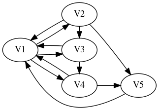

Instructions
===============

There are 6 questions contained in the presentation below. You should
submit to gradescope a report as a ``PDF`` file containing responses
to those questions, written in the style of a *lab report*: you should
write in such a manner that a reader who didn't know the assignment in
advance could read and follow your response.

In some cases, you are asked to write ``python`` code. You should
include the text of the code embedded in your submission. 

(And: You don't have to include any discussion on the
**for-fun** section at the end...)


``PageRank``
===============

Markov chains formed the original basis for the [PageRank
algorithm](https://en.wikipedia.org/wiki/PageRank) used by
[Google](http://www.google.com) to rank web-pages by "importance".

Consider the following basic model of surfing the web. A user begins
surfing at a particular website. From the set of outgoing links from
this site, a choice is made, with each link given equal
probability.  This transition brings the user to a new page, where the
process is repeated. Let's model this system as a Markov Chain: the
nodes in our transition diagram correspond to a certain collection of
websites, and there is a directed edge from node ``A`` to node ``B``
if site ``A`` contains a hyperlink to the site ``B``. Consider a fixed
node ``A``: to assign the probabilities on an edge 
``A`` $\to$ ``B`` 
we just need to count the number ``N(A)`` of outgoing links from site
``A``; then all edges ``A`` $\to$ ``B`` will be given probability
``1/N(A)``.

Number the nodes $a_0,\dots,a_{n-1}$ and write $\mathbf{e}_i$ for the
standard basis vectors. $0 \le i \le n-1$.  We wish to define the
adjacency matrix $A$. It should have the property that $A\mathbf{e}_i$
is the sum of all the standard basis vectors $\mathbf{e}_j$ for which
there is an edge $a_i \to a_j$. A little thought shows that the $s,t$
entry satisfies $$A_{s,t} = \left\{\begin{matrix} 1 & \text{if there
is an edge $a_t \to a_s$} \\ 0 & \text{otherwise}\end{matrix}
\right.$$

Using $A$, one can create the "naive" transition matrix $T$ whose
entries are the probabilities discussed above: as in the course
notebooks, one views the directed graph as the transition diagram of a
probabilistic finite-state machine, and $T$ is the associated
transition matrix.

Suppose the sites we consider were described by the following directed
graph:


Treating this naively, we obtain the following adjacency matrix and
"naive" transition matrix:

$$A=\begin{bmatrix}
  0 & 0 & 0 & 0 & 0  \\
  1 & 0 & 0 & 0 & 0  \\
  1 & 1 & 0 & 0 & 0 \\
  1 & 0 & 1 & 0 & 0 \\
  0 & 1 & 0 & 1 & 0 \\
\end{bmatrix}
\quad \text{and}
\quad
T=\begin{bmatrix}
  0   & 0 & 0 & 0 & 0  \\
  1/3 & 0 & 0 & 0 & 0  \\
  1/3 & 1/2 & 0 & 0 & 0 \\
  1/3 & 0 & 1 & 0 & 0 \\
  0   & 1/2 & 0 & 1 & 0 \\
\end{bmatrix}$$

Notice that ``V5`` is a *sink* - there are no outgoing edges (the site
``V5`` has no links to any of the sites under consideration).  This is
problematic -- the transition diagram we obtain isn't ``strongly
connected`` and the corresponding transition matrix isn't *stochastic*
(the entries in the last column don't sum to 1).

Now, the model is supposed to represent a *random web-surfer*, so to
recover a stochastic matrix, we model the transition from a *sink*
node -- i.e. a node with no "out-connections" -- by having the surfer
randomly choose a site (i.e. a node) from all sites with equal
probability.

In the example, this corresponds to replacing the final column of $T$ by the column
$$\dfrac{1}{5}\begin{bmatrix}
1 & 1 & 1 & 1 & 1 
\end{bmatrix}^T$$

The matrix $T_1$ obtained in this manner is *stochastic*, though it
may well not satisfy the conclusion of the Perron-Frobenius Theorem.

We now introduce a *damping factor*:

> The PageRank theory holds that an imaginary surfer who is randomly
> clicking on links will eventually stop clicking. The probability, at
> any step, that the person will stop is a damping factor
> p. 

We model this by declaring that with probability ``p`` the imaginary
surfer will "stop clicking".  The transition that occurs in this case
lands the surfer on a new node chosen at random from *all* available
nodes (with equal probability).

For the example, for the above diagram, we obtain the matrix

$$C = (1-p) T_1 + \dfrac{p}{5} 
\begin{bmatrix} 
1 & 1 & 1 & 1 & 1 \\ 
1 & 1 & 1 & 1 & 1 \\ 
1 & 1 & 1 & 1 & 1 \\ 
1 & 1 & 1 & 1 & 1 \\ 
1 & 1 & 1 & 1 & 1 \end{bmatrix}$$

which we call the ``PageRank`` transition matrix for the damping
probability $p$.


-----------

1. Given an adjacency matrix $A$, complete the following description
   of the ``i,j`` entry of the corresponding ``PageRank`` transition
   matrix $C$ for the probability $p$.
   
   a. If the ``j``-th column of the matrix $A$ is equal to
      $\mathbf{0}$, then for each ``i=0,...,n-1``:

      $C_{i,j} =$ _______________
	 
   b. Suppose that the sum of the entries of the ``j``-th column of the matrix
      $A$ is equal to $s>0$, then for each ``i=0,...,n-1``:
	 
	  If $A_{i,j} = 0$, then $C_{i,j} =$ ______________
	  
	  If $A_{i,j} = 1$, then $C_{i,j} =$ ______________

2. Use your description in 1. to write a ``python`` function to create
   the ``PageRank`` transition matrix from an adjacency matrix $A$.
   
   Here is a suggested starting point:
   
   ---------
   
   
   ``` python
   import numpy as np
   
   def make_transition(A,p):
       (n,m) = A.shape 
	   if n==m:
           C = np.zeros((n,n))   ## create a matrix of 
           #                     ## zeros of the correct size
           #
           #                     ## insert code to modify 
           #                     ## the entries C[i,j] 
           #
           return C
   ```
   
   ------------
   
   
   Recall that you can obtain the *sum* of the entries of the ``i``th
   column of the matrix ``A`` using the following:
   
   ``s=np.ones(n) @ A[:,i]``
   
   And you can *test* whether the ``i``th column of ``A`` is equal to
   the zero-vector using ``(A[:,i] == 0).all()``; this expression will
   be ``True`` if all entries in the ``i``th column are equal to 0.

   You can use this expression in a conditional statement:
   
   ``` python
   if (A[:,i] == 0).all() then
       ## do something...
   ```
   
   I recommend that you *build up* the matrix ``C`` by assigning
   values to the entries one column at a time, by using a *loop* as follows:
   
   ``` python
   for j in range(n):
       ## insert code to assign values for the j-th column...
   ```
   
   You can assign the value of ``C`` in the ``i``th row and ``j``th
   column using an expression like

   ``` python
   C[i,j] = ...
   ```

   ---------

   Test your code on the example above, as follows:
  
   
   ``` python
   >>> float_formatter = "{:.5f}".format
   >>> np.set_printoptions(formatter={'float_kind':float_formatter})
   >>> A = np.array([[ 0, 0, 0, 0, 0 ],
                     [ 1, 0, 0, 0, 0 ],
                     [ 1, 1, 0, 0, 0 ],
                     [ 1, 0, 1, 0, 0 ],
                     [ 0, 1, 0, 1, 0 ]])
					 
   >>> ## you should see the following output
   >>> make_transition(A,p=0.8)
   array([[0.16000, 0.16000, 0.16000, 0.16000, 0.20000],
          [0.22667, 0.16000, 0.16000, 0.16000, 0.20000],
          [0.22667, 0.26000, 0.16000, 0.16000, 0.20000],
          [0.22667, 0.16000, 0.36000, 0.16000, 0.20000],
          [0.16000, 0.26000, 0.16000, 0.36000, 0.20000]])
   ```


-----------

3. Find a 1-eigenvector for the ``PageRank`` transition matrix ``C``
   when ``p=.8`` and when ``p=.4`` for the directed graph 

   

   Be sure to normalize your eigenvector to obtain *probability
   vectors*.
   
   Explain what the entries in this vector predict about the
   probability of a random surfer landing on one of the five web-sites
   corresponding to the nodes in the diagram.
      
   Compare the information you get from the eigenvector with that
   obtained by studying powers of ``C`` calculated using
   ``np.linalg.matrix_power(C,m)``.
	  
**Remark:** ``PageRank`` uses the ``long-term probability`` as a proxy
for the importance of the page -- the probability with which a random
surfer lands on a page in the long-run determines its ranking.

4. The following diagram describes the same nodes as in problem 2.,
   but includes some additional edges (i.e. links).

   

   Assess the impact of the additional edges on the page rankings
   (when ``p=.8`` and when ``p=.4``) -- i.e. compare the ranking
   obtained for this diagram with that obtained in problem 2. Before
   making your comparison, you'll need to first compute the adjacency
   matrix for this new configuration, and then use your code to find
   the corresponding ``PageRank`` transition matrix.

5. For *any* directed graph, explain why the corresponding
   ``PageRank`` transition matrix for ``p>0`` is a stochastic matrix
   corresponding to a strongly connected aperiodic transition
   diagram. In particular, explain why the conclusion of the
   *Perron-Frobenius Theorem* holds for this matrix.
		
6. The following code can be used to extract formatted data (``json``)
   from a file. The parameter to the function is a file name; this
   ``json`` file should contain data like

   ``` json
   [
     {
       "from": "Blue Whale",
       "to": "Snail"
     },
     {
       "from": "Blue Whale",
       "to": "Alligator"
     },
    ...
   ]	 
   ```
   
   (Here we view these animal names as "sites"; a ``from/to`` pair
   indicates a link.)
   
   and the return value is a pair ``(sites,A)`` where ``sites`` is a
   list of strings containing the name of each "site" that appears in one of
   the ``from/to`` pairs, and ``A`` is the adjacency matrix determined
   by the indicated links.

   ----------
   
   ``` python
   import json
   import numpy as np
   float_formatter = "{:.5f}".format
   np.set_printoptions(formatter={'float_kind':float_formatter})
   
   def bv(it,items):
       return np.array([1.0 if i == items.index(it)
                        else 0.0 for i in range(len(items))])

   ## >>> bv("c",["a","b","c","d"])
   ## array([0.00000, 0.00000, 1.00000, 0.00000])
   
   def adj_from_json(json_file):
     with open(json_file) as f:
         adj_data = json.load(f)
 
     dict = {}
     
     for i in adj_data:
         lfrom = i['from']
         lto   = i['to']
         if lfrom in dict.keys():
             dict[lfrom].add(lto)
         else:
             dict[lfrom] = set()
             dict[lfrom].add(lto)
         if not(lto in dict.keys()):
             dict[lto] = set()
             
     sites = list(dict.keys())
     
     A = np.array([sum([bv(l_to,sites) for l_to in dict[l_from]],
                       np.zeros(len(sites)))
                   for l_from in sites]) 
     return (sites, A)
   ```
   ----------

   Now, here is a file containing data from which you should build an
   adjacency matrix using the function ``adj_from_json``:
   
   [data.json](https://gmcninch-tufts.github.io/2024-Sp-Math087/course-assets/code/MidRep2-data.json)
   
   To use this file, follow these instructions:
   
   Local computer instructions
   ---------------------------
   
   If you use ``python`` on your local computer, save this file to
   your drive and run ``python`` from a shell in the same directory. You can
   then call
   
   ``` python
   (ll,A) = adj_from_json("data.json")
   ```

   ------

   ``Colab`` instructions
   ---------------------------

   If you use ``colab``, proceed as follows. Save the file
   ``data.json`` to your local computer, and then upload that file to
   your ``google drive``.
   
   To enable ``colab`` to see your ``google drive``, execute the following commands in a ``cell``:
   
   ``` python
   from google.colab import drive
   drive.mount('/gdrive')
   ```

   Now change to the correct directory in your ``google drive`` by
   executing the following in a ``cell`` in ``colab`` (you do need the
   ``%`` symbol):
   
   ``` python
   %cd /gdrive/My\ Drive/
   ```
   
   Note for example that you can use the following
   command to see the contents of the currently selected directory of your google drive:
   
   ```python
   %ls
   ```
   
   Now you can run 
   ``` python
   (ll,A) = adj_from_json("data.json"):
   ```
   in a ``colab cell``.
   

   ------
   
   Once you have produced the adjacency matrix ``A`` from
   ``data.json``, use the ``make_transition`` function you wrote in
   the previous exercises to build the ``PageRank`` transition matrix
   ``C`` from the adjacency matrix ``A``, for ``p=0.8``
   
   Now find the page-rankings of these ``pages``, using both the
   eigenvector method and the power-iteration method. For each method,
   report the top ten "sites" by name (when ``p=0.8``). When using the
   power-iteration method, report the number of iterations used.

   > Note that you can get the site name corresponding to index ``i``
   > as folows. If you used ``(ll,A) = adj_from_json("data.json")`` to
   > build the adjacency matrix then the list ``ll`` contains the
   > names, and in particular ``ll[i]`` is the name for index ``i``.


   What happens if you reduce the value of ``p``? How much must you
   vary ``p`` to see any change in the "top-ten" list?
   
   
7. The damping probability ``0 < p ≤ 1`` forces the ``PageRank``
   transition matrix to satisfy the conclusion of the Perron-Frobenius
   Theorem. As we discussed above, from the point-of-view of ranking
   web pages this quantity represents the probability that a random
   web-surfer gets bored and makes a random new choice of sites. In
   particular, this provides a reasonable *self-contained* explanation
   for the use of this ``PageRank`` transition matrix.
   
   On the other hand, one might hope to use the ``PageRank`` approach
   to rank other "linked material". For example, one might try to rank
   published academic papers by citation. 
   
   More precisely: given a collection of academic papers, consider a
   directed graph whose nodes are the papers and for which there is a
   directed edge from **paper A** to **paper B** if **paper A**
   contains a citation to **paper B**.
   
   Suppose that each paper in the collection has at least one citation
   to another paper in the collection; under this assumption, the
   "naive" transition matrix $T$ *is* stochastic. But this transition
   matrix may fail to satisfy the conclusion of the Perron-Frobenius
   Theorem. One can "fix" this problem as before by introducing a
   "damping probability" $0 < p \le 1$ – i.e. by replacing $T$ with
   the matrix
   
   $$(1-p) T + ̣\dfrac{p}{N}\mathbf{1}^{N \times N}$$
   
   where $N$ is the number of papers in the collection and
   $\mathbf{1}^{N \times N}$ denotes the $N \times N$ matrix all of
   whose entries are equal to 1.
   
   Do you think this is a reasonable proposal? What would be the
   explanation for the damping probability from the point-of-view of
   the model?

------

**For Fun:**

Here is some code [^1] for performing a ``web-crawl``:

[web-crawl code](https://gmcninch-tufts.github.io/2024-Sp-Math087/course-assets/code/MidRep2_code.py)

It contains a function with the following signature

``` python
def crawl(start_url,
          save_file,
          n,
          verbose=True,
          follow_relative_links=True,
          max_links_per_page=float('inf'),
          blacklist=[],
          whitelist=[]):
```

which when invoked will "scrape/crawl" the web, beginning at
``start_url``. It finds all links in this first site, and then
proceeds to recursively follow these links. The parameter ``n`` is the
number of pages to include in the ``adjacency data`` to be reported
(roughly speaking, the recursive search can stop once ``n`` pages have
been found).

[^1]: [2024-03-08] I needed to install some packages via `conda` to get it running just now:
``` bash
mamba install lxml beautifulsoup4
```
I believe it works in colab.

For example, you could try something like

``` python
crawl("https://www.comap.com/contests/mcm-icm","comap.txt",500)
```

When finished, this function will output a ``json`` file with name
``save_file``. This file will contain ``from/to`` pairs for links
found in the search.

You can then use the above function ``adj_from_json`` to build an
adjacency matrix from the links in the file built by ``crawl``.

In turn, you can build the ``PageRank`` transition matrix from this
adjacency matrix, and use either the eigenvalue method or the
iteration method to rank the pages that you have considered.

There are a number of comments in the code for ``crawl`` that are
worth reading if you want to play with this code...
