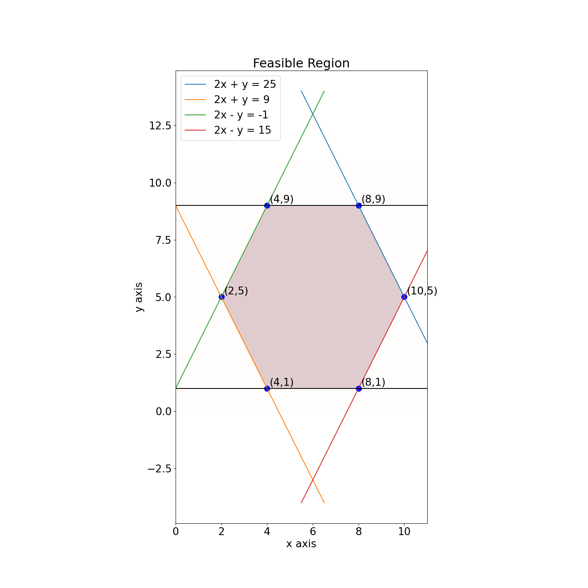

1. A linear program

   Consider the optimization problem: find the $\max$ of $f(x, y) = x + 2y$ subject to the
   following constraints:
   
   \begin{align*}
   y &\le 9 \\
   −y &\le −1 \\
   2x + y &≤ 25 \\
   −2x − y &≤ −9 \\
   −2x + y &≤ 1 \\
   2x − y &≤ 15.
   \end{align*}
   
   a. Draw the feasible region. Label the boundary curves and corner points.

      ::: {.solution}
	  We can use `matplotlib` to draw a sketch of the feasible region, as follows.
	  Of course, you can also just hand sketch it!

      ``` python
	  import matplotlib.pyplot as plt
      import numpy as np
      plt.rcParams.update({'font.size': 19})

      # plot the feasible region
      d = np.linspace(0,11,500)
      e = np.linspace(0,11,500)

      xx,yy = np.meshgrid(d,e)

      fig,ax = plt.subplots(figsize=(15,15))
      ax.imshow(((yy >= 1) & 
	             (yy <= 9) & 
				 (9 <= 2*xx + yy) & 
				 (2*xx + yy <= 25) & 
				 (-1 <= 2*xx - yy) &
                 (2*xx - yy <= 15)
                 ).astype(int),
                extent=(xx.min(),xx.max(),yy.min(),yy.max()),
                origin="lower", 
                cmap="Reds", 
                alpha = 0.2)

      # plot the lines defining the constraints

      def l1(x): return 25 - 2*x

      def l2(x): return 9 - 2*x

      def l3(x): return 2*x + 1

      def l4(x): return 2*x - 15

      x = np.linspace(5.5,11,500)
      ax.plot(x, l1(x) , label="2x + y = 25")

      x = np.linspace(0,6.5,500)
      ax.plot(x, l2(x) , label="2x + y = 9")

      x = np.linspace(0,6.5,500)
      ax.plot(x, l3(x), label = "2x - y = -1")

      x = np.linspace(5.5,11,500)
      ax.plot(x, l4(x), label = "2x - y = 15")

      ax.axhline(y=1, color = "black")
      ax.axhline(y=9, color = "black")

      ax.legend()
      ax.set_title("Feasible Region")
      ax.set_xlabel("x axis")
      ax.set_ylabel("y axis")

      def ann_pt(x,y):
          "annotate the point (x,y)"
          s = f"({x},{y})"
          ax.annotate(s,xy=(x,y),xytext=(5,5),textcoords='offset points')

      ax.scatter(8, 9,s=100,color="blue")
      ann_pt(8,9)

      ax.scatter(4,9,s=100,color="blue")
      ann_pt(4,9)

      ax.scatter(4,1,s=100,color="blue")
      ann_pt(4,1)

      ax.scatter(8,1,s=100,color="blue")
      ann_pt(8,1)

      ax.scatter(2,5,s=100,color="blue")
      ann_pt(2,5)

      ax.scatter(10,5,s=100,color="blue")
      ann_pt(10,5)

      fig.savefig("feasible.png")
	  ```
      which results in
	  
	  {width=750px}
	  
      :::


   b. Find the maximum value of f and the point where it occurs.

      ::: {.solution}
	  
	  We evaluate the function `f` at each intersection point.
	  
	  ``` python
	  intersection_pts = [ (4,9), (8,9), (10,5), (8,1), (4,1), (2,5) ]
	  
	  def f(x,y): return x + 2*y
	  
	  ## make a list of the pairs ( f(pt), pt) ) and sort the list
	  
	  a=[ ( f(pt[0],pt[1]) , pt ) for pt in intersection_pts ]

      a.sort()
	  ```
	  
	  This yields
	  
	  ``` python
	  [(6, (4, 1)), (10, (8, 1)), (12, (2, 5)), (20, (10, 5)), (22, (4, 9)), (26, (8, 9))]
	  ```

      We see that the *maximum value of `f`* is 26, and this maximum occurs at
	  $(x,y) = (8,9)$.
	  :::
	  
   c. Verify your answer using `SciPy`.

      ::: {.solution}
	  
	  We need to define the *objective function* `f` as a *vector* `c`,
      and we must define the `inequality constraints.`
	  
	  ``` python
	  import numpy as np
	  c = np.array([1,2])
	  
	  Aub = np.array([ [0,1],
	                   [0,-1],
					   [2,1],
					   [-2,-1],
					   [-2,1],
					   [2,-1]
					   ])
	  
	  bub = np.array([ 9,
	                  -1,
					  25,
					  -9,
					  1,
					  15])
					  

	  ```
	  
	  and now we run the `linprog` solver. Remember that since we want to *maximize* the objective function,
	  we must use `-c` for the objective function!
	  
	  ``` python
	  from scipy.optimize import linprog
	   linprog((-1)*c,A_ub=Aub,b_ub=bub)
	  ```
	  This gives the result
	  ``` python
              message: Optimization terminated successfully. (HiGHS Status 7: Optimal)
              success: True
               status: 0
                  fun: -26.0
                    x: [ 8.000e+00  9.000e+00]
                  nit: 2
                lower:  residual: [ 8.000e+00  9.000e+00]
                       marginals: [ 0.000e+00  0.000e+00]
                upper:  residual: [       inf        inf]
                       marginals: [ 0.000e+00  0.000e+00]
                eqlin:  residual: []
                       marginals: []
              ineqlin:  residual: [ 0.000e+00  8.000e+00  0.000e+00  1.600e+01
                                    8.000e+00  8.000e+00]
                       marginals: [-1.500e+00 -0.000e+00 -5.000e-01 -0.000e+00
                                   -0.000e+00 -0.000e+00]
       mip_node_count: 0
       mip_dual_bound: 0.0
              mip_gap: 0.0	  
	  ```
	  which confirms that the max of 26 occurs at the point `(8,9)`
	  (see the fields `fun` and `x` in the result).
	  
	  :::
	  

2. Bakers

   A bakery wants to sell forty five Valentine’s Day gift bags. They
   have decided to offer two types of bags: 
   
   - Bags of type A will contain four cupcakes and two cookies, and
     will be sold for $12
   
   - bags of type B will contain two cupcakes and five cookies, and
     will be sold for $16
   
   The bakery has 90 cookies and 115 cupcakes in total.  Write the
   bakery’s optimization problem as a linear program. Solve this to
   determine how many baskets of both types should be made. If a
   fractional solution is obtained, round down to whole number
   solutions. What is the maximum profit? 
   
   You may solve this by drawing the feasible region or using python.

   ::: {.solution}
   
   We've written some code that assembles the objective function
   `obj`, and the constraint data `Aub` and `bub` in order to use
   `scipy.optimize.linprog` to solve the linear program.
   
   ``` python
   import numpy as np
   from scipy.optimize import linprog


   bags = { 'A' : { 'price': 12.0,
                    'cupcakes': 4,
                    'cookies': 2
                  },
		    'B' : { 'price': 16.0,
                    'cupcakes': 2,
                    'cookies': 5
                  }
          }

   items = [ item for item in bags.keys() ]

   resources = { 'cupcakes': 115.0,
                 'cookies': 90.0
                 }

   # build the (0-indexed) standard basis vector
   # e.g. sbv(2,4) returns [ 0.0, 0.0, 1.0, 0.0 ]
   #
   def sbv(index,len):
       return np.array([ 1.0 if index == i else 0.0 for i in range(len) ])

   # return the standard basis vector corresponding to the index of an entry in a list
   # e.g. itemVector('b',['a','b','c','d']) returns [ 0.0, 1.0, 0.0, 0.0 ]
   #
   def itemVector(x,ll):
       return sbv(ll.index(x),len(ll))

   # objective function, as a vector
   obj = sum([ bags[item]['price']*itemVector(item,items) for item in items ])

   # upper bound constraint matrix
   Aub = np.array([ [ bags[item][resource]
                      for item in items
                     ]
                    for resource in resources.keys()
                   ])

   # upper bound constraint vector
   bub = np.array([ resources[res] for res in resources.keys()])

   # remember that this is a maximizing problem, so multiply the objective function by (-1)
   #
   res = linprog( (-1)*obj, A_ub = Aub, b_ub = bub)

   ```

   This is perhaps overly complicated for a 2-variable problem, but it yields
   the following values:
   ``` python
   obj 
   => [12. 16.]
    
   Aub
   => [[4 2]
       [2 5]]
	   
   bub 
   => [115. 90.]
   
   res
   =>
           message: Optimization terminated successfully. (HiGHS Status 7: Optimal)
           success: True
            status: 0
               fun: -426.25
                 x: [ 2.469e+01  8.125e+00]
               nit: 2
             lower:  residual: [ 2.469e+01  8.125e+00]
                    marginals: [ 0.000e+00  0.000e+00]
             upper:  residual: [       inf        inf]
                    marginals: [ 0.000e+00  0.000e+00]
             eqlin:  residual: []
                    marginals: []
           ineqlin:  residual: [ 0.000e+00  0.000e+00]
                    marginals: [-1.750e+00 -2.500e+00]
    mip_node_count: 0
    mip_dual_bound: 0.0
           mip_gap: 0.0   

   ```
   
   This result indicates that the max profit should be $426.25$, obtained at the point
   $(24.69, 8.125)$. However, since we need to round to a whole number we find that we should
   make 24 or 25 `A`-type bags and 8 or 9 `B` type bags.

   Let's compute 
   
   (notice that the `numpy` operation `M @ v` means "multiply the matrix M and the vector v".
   You could also do this via `np.matmul(M,v)`).
   ``` python 
   pp = [ [24,8], [24,9], [25,8], [25,9] ]

   print("\n".join([ f"{p} => {Aub @ np.array(p)}    {Aub @ np.array(p) <= bub}" 
         for  p in pp ]))
   
   =>  
   [24, 8] => [112  88]   [ True  True]
   [24, 9] => [114  93]   [ True False]
   [25, 8] => [116  90]   [False  True]
   [25, 9] => [118  95]   [False False]
   ```
    
   This shows that, for example, making 24 `A` bags and 9 `B` bags requires 114 cupcakes and 93 cookies
   (which exceeds available resources).
   
   Inspecting the list, we see that we should make 24 `A` bags and 8 `B` bags, yielding a profit of $416
   
   ``` python
   obj @ np.array([24,8]) 
   =>
   416
   ```
   
   :::


3. A farmer owns 45 acres of land. This season, she will plant each
   acre with either wheat or corn. Each acre of wheat yields \$200 in
   seasonal profits, whereas each acre of corn yields \$300 in
   seasonal profits. Each acre of wheat requires 3 workers and 2 tons
   of fertilizer, while each acre of corn requires 2 workers and 4
   tons of fertilizer. The farmer has 100 workers and 120 tons of
   fertilizer available. Determine how many acres of wheat and corn
   need to be planted to maximize profits for the season. (Non-integer
   acreage values are allowed in the solution.)

   ::: {.solution}
   We've written some code that assembles the objective function
   `obj`, and the constraint data `Aub` and `bub` in order to use
   `scipy.optimize.linprog` to solve the linear program.   
   
   ``` python
   import numpy as np
   from scipy.optimize import linprog
   

   ## requirements per acre,
   ## as a (nested) python dictionary
   ## e.g. `crop_specs['corn']['fertilizer']` reflects the 
   ## amount of fertilizer (in tons) required
   ## for an acre of corn
   crop_specs = { 'wheat' : { 'profits': 200.0,
                              'workers': 3,
                              'fertilizer': 2,
                              'acres': 1
                             },
                  'corn' : { 'profits': 300.0,
                             'workers': 2,
                             'fertilizer': 4,
                             'acres': 1
                            }
                 }
   
   crops = [ c for c in crop_specs.keys() ]
   
   resource_specs = { 'workers': 100.0,
                      'fertilizer': 120.0,
                      'acres': 45
                     }
   
   resources = [ r for r in resource_specs.keys() ]
   
   # build the (0-indexed) standard basis vector
   # e.g. sbv(2,4) returns [ 0.0, 0.0, 1.0, 0.0 ]
   #
   def sbv(index,len):
       return np.array([ 1.0 if index == i else 0.0 for i in range(len) ])
   
   # return the standard basis vector corresponding to the index of an entry in a list
   # e.g. itemVector('b',['a','b','c','d']) returns [ 0.0, 1.0, 0.0, 0.0 ]
   #
   def itemVector(x,ll):
       return sbv(ll.index(x),len(ll))
   
   # objective function, as a vector
   obj = sum([ crop_specs[c]['profits']*itemVector(c,crops) for c in crops ])
   
   # upper bound constraint matrix
   # this matrix has a row for each `resource`,
   # and the entries for that row are obtained from the `crop_specs`
   Aub = np.array([ [ crop_specs[c][res]
                      for c in crops
                     ]
                    for res in resources
                   ])
   
   # upper bound constraint vector
   bub = np.array([ resource_specs[res] for res in resources])
   
   res = linprog( (-1)*obj, A_ub = Aub, b_ub = bub)
   ```
   
   This gives the following results:

   
   ``` python
   obj 
   => 
   [200. 300.]
   
   Aub 
   =>
   [[3 2]
    [2 4]
    [1 1]]
	
	bub
	=>
   [100. 120.  45.]
   
   res
   =>
              message: Optimization terminated successfully. (HiGHS Status 7: Optimal)
           success: True
            status: 0
               fun: -10000.0
                 x: [ 2.000e+01  2.000e+01]
               nit: 2
             lower:  residual: [ 2.000e+01  2.000e+01]
                    marginals: [ 0.000e+00  0.000e+00]
             upper:  residual: [       inf        inf]
                    marginals: [ 0.000e+00  0.000e+00]
             eqlin:  residual: []
                    marginals: []
           ineqlin:  residual: [ 0.000e+00  0.000e+00  5.000e+00]
                    marginals: [-2.500e+01 -6.250e+01 -0.000e+00]
    mip_node_count: 0
    mip_dual_bound: 0.0
           mip_gap: 0.0

   ```
   
   The result shows that the maximal profit is \$10,000 and it is achievd
   by planting 20 acres of corn and 20 acres of wheat.
   
   This may seem slightly surprising, since after all we have 45 available acres.
   
   Let's investigate this solution a bit:
   
   ``` python
   usage = Aub @ np.array([20,20])

   for r in resources:
       print(f"{r} -> {usage[resources.index(r)]}")
	  
   =>
   workers -> 100
   fertilizer -> 120
   acres -> 40

   ```
   
   We see that this solutions requires all available of workers
   and all available tonnage of fertilizer, so it is indeed
   plausible that the maximum profit is achieved without use of the
   remaining 5 acres of land.
   
   :::
