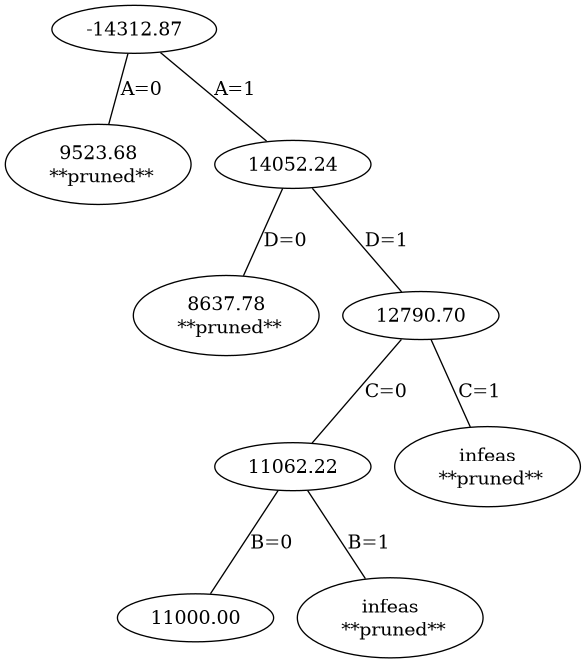
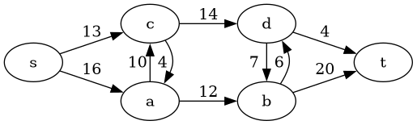

1. One man’s trash

   You are at a yard sale, and have spied four crates of goods. You’ve
   estimated the value of each crate; these values are listed as
   **actual value** in the following table.
   
   The owner has no idea what these items are worth, and is selling
   them for far less than they are worth; the prices being asked are
   listed as **sales price** in the following table).

   Finally, the *weight* of each of the crates is listed in the table,
   as well.
   
   | crate | actual value | sales price | weight in kg |
   |-------|--------------|-------------|--------------|
   | A     | $ 5000       | $ 24        |         75.5 |
   | B     | $ 600        | $ 76        |          2.7 |
   | C     | $ 3500       | $ 43        |          3.3 |
   | D     | $ 6000       | $ 754       |          6.7 |

   
   
   You realize that you can purchase these crates and sell them at a
   much higher mark up. However, you walked to the yard sale and can
   only buy what you can carry on your person.
   
   You have 800 dollars, and you and your friend together can carry an estimated 85 kg.
   
   Fortunately, you have identified this as an integer programming
   problem!
   
   a. Describe an integer linear program which models the situation
      (think carefully about what values the variables can take).
	  
	  ::: {.solution}
	  
	  The integer program problem is:
	  
	  consider a vector `x = [A, B, C, D]` of variables, where `A`
      represents the purchase of the crate `A`, `B` represents the
      purchase of the crate `B`, etc.
	  
	  `maximize`
	  
	    `actual_value = [ 5000, 600, 3500, 6000 ] . x.T = 5000 A + 600 B + 3500 C + 6000 D`
	  
	  subject to:
	  
	  - `[ 24, 76, 43, 754 ] . x.T <= 800` (i.e. `24 A + 76 B + 43 C + 754 D <= 800`),
	  
	  - `[ 75.5, 27, 3.3, 6.7] . x.T <= 85` (i.e. `75.5 A + 27 B + 3.3 C + 6.7 D <= 85`), and
	  
	  - `A,B,C,D` in `[ 0,1 ]`
	  :::
	  
   b. Use the branch and bound algorithm to find the optimal solution,
      explaining your choices for which variables to branch on and
      where to prune the tree.
	  
	  ::: {.solution}
	  
	  We first solve the *relaxed* linear program. Note that we specify
	  `0 <= A,B,C,D <=` using the `bounds` argument to `linprog`.
	  
	  ``` python
      import numpy as np
      from scipy.optimize import linprog
      
      actual_value = np.array([ 5000, 600, 3500, 6000 ])
      sales_price  = np.array([ 24, 76, 43, 754 ])
      weight       = np.array([ 75.5, 27, 3.3, 6.7 ])
      
	  bounds = 4*[(0,1)]
	  
      Aub = np.array([sales_price,weight])
      bub = np.array([800,85])
      
      res = linprog((-1)*actual_value, A_ub = Aub, b_ub = bub,bounds=bounds)

      pprint({ 'obj_value': res.fun, 'solution': res.x})
	  =>
      {'obj_value': -14312.872801068243,
	  'solution': array([0.99583731, 0.        , 1.        , 0.97228104])}
	  ```
	  
	  The relaxed solution we get is `A = 0.99583731, B= 0, C=1, D=0.97228104`.
	  
	  We are now going to branch; we'll use the following code.
	  
	  ``` python
	  # use the python pretty-printer
	  from pprint import pprint
	  
	  # make the jth standard basis vector of length 'size'
	  def sbv(j,size):
         return np.array([1.0 if i == j else 0.0 for i in range(size)])

      # record the data for the linear program as a dictionary, for ease of passage
      lp = { 'obj': actual_value,
             'Aub': Aub,
             'bub': bub,
             'bounds': bounds
             }
      
      def branch(specs,lp):
          n = len(lp["obj"])

          # each spec is a dictionary {"var": a, "value": b}

          # first, lookup the indices of the variable for each spec
          crates = ['A','B','C','D']
          indices = [ crates.index(spec['var']) for spec in specs ]

          # now create equality constraints for the "specs"
          Aeq = np.array([sbv(index,4) for index in indices])
          beq = np.array([spec["value"] for spec in specs]) 
       
          result = linprog((-1)*lp["obj"], 
                           bounds = lp["bounds"], 
                           A_ub=lp["Aub"], 
                           b_ub=lp["bub"], 
                           A_eq = Aeq, 
                           b_eq = beq)
      
          if result.success:
              return {"obj_value": (-1)*result.fun,
                      "solution": result.x}
          else:
              return "lin program failed"
	  
	  ```
	  
	  Since the values of `B` and `C` are already integers in the
      relaxed solution, and since `1-A < 1-D`, we first branch on
      `A`.
	  
	  
	  - `A=0`: We solve the linear program specifying `A=0`.
	  
	    ``` python
		res_A0 = branch([{'var': 'A', 'val': 0}],lp)  
		pprint(res_A0)
		=>
		{'obj_value': 9523.684210526317,
		'solution': array([-0.        ,  0.03947368,  1.        ,  1.        ])}
		```
		  
	  - `A=1`: We solve the linear program specifying `A=1`.
	  
	    ``` python
		res_A1 = branch([{'var': 'A', 'val': 1}],lp)  
		pprint(res_A1)
		=>
		{'obj_value': 14052.238805970152,
		'solution': array([1.        , 0.        , 1.        , 0.92537313])}
		```
	  
	  Since the `obj_value` is larger for `A=1`, we branch below that value on `D`.
	  
	    - `A=1, D=0`
		 
		  ``` python
		  res_A1_D0 = branch([{'var': 'A', 'val': 1}, 
		                      {'var': 'D', 'val': 0}],lp)
		  pprint(res_A1_D0)
		  =>
		  {'obj_value': 8637.777777777777,
		  'solution': array([ 1.        ,  0.22962963,  1.        , -0.        ])}
		  ```
		
		- `A=1, D=1`

		  ``` python
		  res_A1_D1 = branch([{'var': 'A', 'val': 1}, 
		                      {'var': 'D', 'val': 1}],lp)		  
		  pprint(res_A1_D1)
		  =>
		  {'obj_value': 12790.697674418605,
		  'solution': array([1.        , 0.        , 0.51162791, 1.        ])}
		  ```

	   The largest objective value so far is `A=1,D=1` so we branch
       below that node, on the variable `C`.
	   
	   - `A=1, D=1, C=0`
	   
	     ``` python
		 res_A1_D1_C0 = branch([{'var': 'A', 'val': 1},
                                {'var': 'D', 'val': 1},
								{'var': 'C', 'val': 0}],lp)
	     pprint(res_A1_D1_C0)
		 =>
		 {'obj_value': 11062.222222222223,
		 'solution': array([ 1.       ,  0.1037037, -0.       ,  1.       ])}		 
		 ```
	   
	   - `A=1, D=1, C=1`
	   
	     ``` python
		 res_A1_D1_C1 = branch([{'var': 'A', 'val': 1},
                                {'var': 'D', 'val': 1},
                                {'var': 'C', 'val': 1}],lp)
		 pprint(res_A1_D1_C1)
		 =>
		 'lin program failed'
		 ```
		 
		 *This linear program is infeasible*, so we **prune**.
	  
	  Now we branch on `B` below `A=1, D=1, C=0`:
	  
	  - `A=1, D=1, C=0, B=0`
	  
	    ``` python
		res_A1_D1_C0_B0 = branch([{'var': 'A', 'val': 1},
                                 {'var': 'D', 'val': 1},
								 {'var': 'C', 'val': 0},
								 {'var': 'B', 'val': 0}],lp)
		pprint(res_A1_D1_C0_B0)
		=>
		{'obj_value': 11000.0, 'solution': array([ 1., -0., -0.,  1.])}
		```
	  
	  - `A=1, D=1, C=0, B=0`

	    ``` python
		res_A1_D1_C0_B1 = branch([{'var': 'A', 'val': 1},
                          {'var': 'D', 'val': 1},
                          {'var': 'C', 'val': 0},
                          {'var': 'B', 'val': 1}],lp)
	    pprint(res_A1_D1_C0_B1)
		=>
		'lin program failed'
		```
		*This linear program is infeasible*, so we **prune** this node.
		

      Now we pause to inspect our results so far. We have found an integral solution
	  `A=1, D=1, C=0, B=0` with `obj_value = 11000`.
	  
	  This objective value exceeds `9523` which is the `obj_value` at `A=0`. 
	  So we prune at `A=0`
	  
	  And this objective value exceeds `8637` which is the `obj_value`
	  at `A=1,D=0`. So we prune at `A=1,D=0`.
	  
	  So we find that the optimal integral solution to the linear program
	  is to buy the `A`-crate and the `D`-crate, getting real value of `11,000`.

	  :::
	  
	  
	  
	  
   c. Draw the branch and bound tree for your solution.
  
      ::: {.solution}
	  ``` python
      from graphviz import Graph
      
      nodes = { 0: res.fun,
                1: res_A0['obj_value'],
                2: res_A1['obj_value'],
                3: res_A1_D0['obj_value'],
                4: res_A1_D1['obj_value'],
                5: res_A1_D1_C0['obj_value'],
                7: res_A1_D1_C0_B0['obj_value'],
                }
      
      pruned = [1,3,6,8]
      
      def describe(n):
          if n in nodes.keys():
              if n in pruned:
                  return f"{nodes[n]:.2f} **pruned**"
              else:
                  return f"{nodes[n]:.2f}"
          else:
              return "infeas **pruned**"
      
      dot = Graph()
      dot.filename='PS4--tree'
      dot.format='png'
      
      
      for n in range(9):
          dot.node(f"{n}",describe(n))
          
      dot.edge('0','1','A=0')
      dot.edge('0','2','A=1')
      dot.edge('2','3','D=0')
      dot.edge('2','4','D=1')
      dot.edge('4','5','C=0')
      dot.edge('4','6','C=1')
      dot.edge('5','7','B=0')
      dot.edge('5','8','B=1')
      
      dot.render()
      ```
	  
	  
	  
	  :::
  
   (**Hint**: Note that you should use `linprog` to solve the relaxed
   linear program, initially with your variables constrained between 0
   and 1).


  


2. Consider the following directed graph (see below for the code producing this graph).
   
   

   a. Find the `minimum cut` value for this weighted
      directed graph.
	  
	  (Recall that this means to consider all possible partitions of
	  the nodes into an $s$-group and a $t$-group.
	 
	  To identify such a partition, it is enough to indicate the
	  $s$-group. For example, $s$, $a$ and $c$ together form a
	  possible $s$-group.  The edge-cuts required to form this
	  $s$-group involve the edges $c \to d$ and $a \to b$; thus the
	  cut-value for this partition is $14 + 12 = 26$.
	 
	  Make a list all possible $s$-groups and indicate the
	  corresponding cut-values. Remember that we are only interested
	  in partitions that arise "from cuts" -- thus, an $s$-group
	  should be "connected". And remember that cut value only involve
	  capacities of edges $u \to v$ where $u$ is in the $s$-group and
	  $v$ is in the $t$-group (you would not also count the capacity
	  of an edge $v \to u$ if it exists).

      ::: {.solution}
	  We make a list whose elements are pairs
	  `( s-groups, edge-cut values )`
	  for all possible `s`-groups:

      ``` python
      pp = [ ( ['s'], [13, 16] ),
             ( ['s', 'a'], [13, 10, 12] ),
             ( ['s', 'c'], [16, 4, 14] ),
             ( ['s', 'a', 'c'], [12, 14] ),
             ( ['s', 'a', 'b'], [13, 10, 7, 20] ),
             ( ['s', 'a', 'b', 'c'], [14, 6, 20] ),
             ( ['s', 'a', 'c', 'd'], [12, 7, 4] ),
             ( ['s', 'a', 'b', 'c', 'd'], [4,20])
            ]
      
	  # sum the cut-values, and sort by the results
      def min_cut(data):
          aa = [ (s, sum(cuts) ) for  (s,cuts) in data]
          aa.sort(key=lambda x: x[1])
          return aa
              
      pprint(min_cut_data)
	  =>
	  [(['s', 'a', 'c', 'd'], 23),
       (['s', 'a', 'b', 'c', 'd'], 24), 
	   (['s', 'a', 'c'], 26),
	   (['s'], 29),
	   (['s', 'c'], 34),
	   (['s', 'a'], 35),
	   (['s', 'a', 'b', 'c'], 40),
	   (['s', 'a', 'b'], 50)]
	  ```
	  The result shows that the `min-cut` is achieved by considering
	  the `s`-group `['s','a','c','d']`. For this, you must cut the
	  edge `a -> b`, `d->b`, and `d->t`; these have value 12, 7, 4. This shows 
	  that the `min-cut` value is 23.
	  
	  
	  :::
	  
	  
	  

   b. By strong duality, you now know the `maximum flow` value for the
      graph. Does strong duality tell you how to find a flow which
      achieves this value? Why or why not?

      ::: {.solution}
	  Strong duality tells us that the `max-flow` is 23. But It doesn't tell us
	  how to find the flow `f` that achieves `|f| = 23`.
	  :::

   c. Suppose that the capacity on the edge $d \to t$ is increased
      from its current value of 4. By how much must this capacity
      change in order to change the ``min cut`` configuration?
	  
	  ::: {.solution} 
	  
	  Since the `min-cut` is achieved with the group
	  `['s','a','c','d']`, the edge `d -> t` is involved in the edge cuts.
	  So increasing the edge weight will change the configuration.
	  

      To see what happens, we can create a function to modify the
      specified edge-weight:
	  
	  ``` python
	  def pp1(x):
        return [ ( ['s'], [13, 16] ),
                 ( ['s', 'a'], [13, 10, 12] ),
				 ( ['s', 'c'], [16, 4, 14] ),
				 ( ['s', 'a', 'c'], [12, 14] ),
				 ( ['s', 'a', 'b'], [13, 10, 7, 20] ),
				 ( ['s', 'a', 'b', 'c'], [14, 6, 20] ),
				 ( ['s', 'a', 'c', 'd'], [12, 7, 4+x] ),
				 ( ['s', 'a', 'b', 'c', 'd'], [4+x, 20])
				 ]
				 
      for c in range(1,5):
        print(f"{c} -> {min_cut(pp1(c))[0]}")
	  =>
	  1 -> (['s', 'a', 'c', 'd'], 24)
	  2 -> (['s', 'a', 'c', 'd'], 25)
	  3 -> (['s', 'a', 'c'], 26)
	  4 -> (['s', 'a', 'c'], 26)
	  ```
	  
	  We see that raising the indicated edge weight by 1 or 2 (i.e. to
	  a value of 5), the `min-cut` is achieved with the same
	  `s`-group, but once the edge weight is increased by 3 the
	  `min-cut` is achieved by a different choice of `s`-group.
	  
	  :::
	  
   d. Would increasing the capacity for the edge $b \to t$ from its
      current value of 20 affect the maximum flow value? Why or why
      not?

      ::: {.solution}
	  
	  No, because the edge `b -> t` is not involved in the `min-cut` configuration.
	  
	  :::

   e. Explain whether or not the following statement seems reasonable,
      and why: "The ``min cut`` configuration (i.e. the edges involved
      in the ``min cut``) reflects the maximal bottleneck in the
      system."
   

   Here is the code used to produce the graph; you can [download it here.](/course-assets/images/PS4--graph.py)
   
   ``` python
   from graphviz import Digraph

   dg = Digraph()
   #dg = Digraph(engine='neato')
   
   dg.attr(rankdir='LR')
   
   V = [ 's', 'a', 'b', 'c', 'd', 't' ]
   
   weights = { ('s','a'):   16,
               ('s','c'):   13,
               ('c','a'):    4,
               ('a','c'):   10,
               ('a','b'):   12,
               ('c','d'):   14,
               ('d','b'):    7,
               ('b','d'):    6,
               ('b','t'):   20,
               ('d','t'):    4
              } 
   
   c.node('t')
   
   with dg.subgraph() as c:
       c.attr(rank='same')
       for x in ['a','c']:
           c.node(x)
   
   with dg.subgraph() as c:
       c.attr(rank='same')
       for x in ['b','d']:
           c.node(x)
   
   c.node('s')        
           
   for (f,t) in weights.keys():
       wt = f"{weights[(f,t)]}"
       dg.edge(f,t,wt)
   
   dg.filename='PS4--graph'
   dg.format='png'
   dg.render()
   ```
