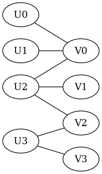

\newcommand{\xx}{\mathbf{x}}
\newcommand{\yy}{\mathbf{y}}
\newcommand{\ww}{\mathbf{w}}
\newcommand{\pp}{\mathbf{p}}

1. A mining company needs to set up supply line between a set of
   quarries $U$ and a set of processing plants $W$. The company is
   interested in setting up perfect matchings of quarries to plants,
   i.e.  each quarry should have a supply line to a unique processing
   plant, such that no quarry or plant is on two supply
   lines. Conveniently, there are as many quarries as there are
   processing plants. Less conveniently, supply lines need to travel
   along roads. Let $E$ be the set of roads. We assume that each road in
   $E$ starts at a quarry and travels directly to a processing plant,
   and that the roads do not intersect.
   
   a. Suppose that |U| = |W| = 4 and that there are seven roads
      total. Construct an example where no perfect matching is
      possible. 
	  
	  **Suggestion**: for this problem and the rest, we suggest you
      model this set up as a bipartite graph.
	  
	  ::: {.solution}
	  Write `U0,U1,U2,U3` for the `U`-nodes, and similarly for the `V` nodes. Then
	  
	  
	  
	  describes a bi-partite graph with 7 edges and no perfect matches.
	  To see that there are no perfect matchings, note that
	  the set `[U0,U1]` has two elements, but its set of neighbors is
	  `[V0]`, which has only one element. So the "marriage Theorem" implies
	  that there is no perfect matching.
	  
	  (*Of course, there are many other graphs that work!*)
	  :::

	  
   b. If no perfect matching exists, the company would like to know
      what is the maximal number of quarry/plant pairs such that no
      quarry or plant is on two supply chains (call this a maximal
      matching). Compute this for your example in a). How many
      additional roads must be made in order for a perfect matching to
      exist?
	  
	  ::: {.solution}
	  
	  We know there can be no perfect matching, so any matching `M` must have size `<= 3`.
	  So we will have found a maximal matching if we find a matching of size `3`.
	  
	  Now, just notice that `M = [(U1,V0),(U2,V1),(U3,V2)]` is a matching
	  of length 3; it is therefore a *maximal* matching.
	  
	  
	  We only need 1 additional edge (road) to create a perfect
	  matching; namely, we require the existence of an edge `(U0,V3)`.
	  :::
	  
   c. If $|U| = |W| = n$, what is the largest possible size of $E$?
      Give your answer as an expression in $n$.
	  
	  ::: {.solution}
	  Each vertex `u ∈ U` can be connected to at most `n` vertices in `V`.
	  Since there are `n` choices for `u`, there are no more than `n*n`=$n²$ edges.
	  :::
	  
   d. Suppose that for each $x ∈ U$, there is exactly one road
      involving $x$, and write this edge as $x → w(x)$ for some $w(x) ∈
      W$. Explain why the size of a maximum matching is equal to the
      number of distinct nodes $\{w(x)\}$.
	  
	  ::: {.solution}
	  Write `W0 = [ w(x) for x in V ]`. We must argue two things:

      - any matching `M` has `|M| <= |W0|`,
	  
	  - there is a matching  `M0` with `|M0| = |W0|`.
	  
	  If `M` is any matching, consider the subset `T=[ v for (u,v) in
	  M ]` of `W` consisting of the targets of edges in `M`.  By the
	  assumption on the graph, `T` is contained in the set `W0`, so
	  
	  ```
	  |M| = |T| <= |W0|
	  ```
	  
	  This proves the first requirement.
	  
	  As to the second, for each `w in W0` we may *choose* an element `x_w in V` with
	  `w = w(x_w)`.
	  
	  > (We can even make this choice algorithmic if we choose an
	  > *ordering* of `V`.  To find `x_w` for a given `w in W`, we
	  > just search through elements `x` of `V` in order, and take for
	  > `x_w` the *first* element `x in V` for which `w(x) = w`.)
	  
	  Then form the matching
	  
	  ```
	  M0 = [ (x_w,w) for w in W0 ]
	  ```
	  
	  Then `|M0| = |W0|` so by the previous observation, `M0` is a *maximal* matching.
	  
	  
	  :::
	  
   e. (Optional) Suppose that `|U| = |W| = n` and let `m = |E|`. Can you
      always find a configuration of roads such that a perfect
      matching is impossible? Put differently, is there a minimal m
      such that a perfect matching will exist no matter how the roads
      are placed?
	  
	  ::: {.solution} 
	  
	  At one extreme, for the *regular graph* having
	  $n²$ edges, there is of course a perfect matching; e.g. this
	  follows from the Marriage Theorem, since `|N(X)| = n >= |X|` for each
	  non-empty subset `X` of `V`.
	  
	  At the other extreme, we see from (d) that there are graphs with
	  `|E| = n` for which there is no perfect matching (in the
	  notation of part (d), just arrange that
	  
	  ```
	  |W0| = length([ w(x) for x in V ]) < n.
	  ```
	  
	  (For example, this can be achieved by choosing a vertex `w0` in
      `W`, and - in the notation of (d) - declare that `w(x) = w0` for
      every `x in V`.)
	  
	  So there is *some* minimal `m` with $n < m ≤ n^2$ such that if `|E| = m`
	  there is always a perfect matching. Of course, this argument doesn't give 
	  a formula for `m`...
	  :::
	  
	  
2. A streaming service wants to model the annual growth rate of its
   subscribers. The data shows that they can roughly predict the
   behavior of customers based on how long they have been users of the
   service: Let $p_n$ be the current number of subscribers who have had
   the service for less than a year, and $p_o$ be the current number of
   subscribers who have had the service for more than a year (so in
   total there are $p_n + p_o$ subscribers).  For convenience we will
   refer to the two types of subscriber as “new” and
   “old”. 
   
   Let $\pp = \begin{bmatrix} p_n \\ p_o \end{bmatrix}$ be a vector
   recording the current subscriber population, and write $\pp^*$ be the
   subscriber population in one year’s time. Then the data shows that $\pp∗
   = A\pp$, where $A$ is the matrix given by
   $$A = \begin{bmatrix} 1 & 0 \\ 0.8 & 0.5 \end{bmatrix}.$$

   This is, writing $\pp^* = \begin{bmatrix} q_n \\ q_o
   \end{bmatrix}$, there will be $q_n$ "new" users in one years time,
   and $q_o$ "old" users.

   a. What percentage of current new users will still be subscribed by
      the start of the next year?

      How does this retention rate differ for old users?
   
      ::: {.solution}
	  
	  Since $A \begin{bmatrix} 1 \\ 0 \end{bmatrix} = \begin{bmatrix} 1 \\ 0.8 \end{bmatrix}$,
	  we see that 80% of the current *new users* will be *old users* next year.
	  
	  On the other hand,
	  $A \begin{bmatrix} 0 \\ 1 \end{bmatrix} = \begin{bmatrix} 0 \\ 0.5 \end{bmatrix}$,
	  so we see that 50% of current *old users* will remain *old users* next year.
	  
	  The retention rate is higher for *new users*.
	  :::
   
   c. It turns out that A has eigenvalues $λ = 1$ and $\lambda = 0.5$. Find an
      eigenvector for the eigenvalue $λ = 1$ and use it to describe the
      long term behavior of the user population for this streaming
      service.  In the long run, what will the ratio of new to old
      users be?
	  
	  ::: {.solution}
	  
	  To find an eigenvector for $\lambda = 1$, we must solve the matrix equation
	  $$0 = (A - I)\xx = \begin{bmatrix} 0 & 0 \\ 0.8 & -0.5 \end{bmatrix} \xx.$$
	  So $$\xx = \begin{bmatrix} 0.5 \\ 0.8 \end{bmatrix}$$
	  is a 1-eigenvector.
	  
	  Since $.5 < 1$, we know that $$\lim_{n \to \infty} A^n \pp = \xx
	  = c \begin{bmatrix} 0.5 \\ 0.8 \end{bmatrix}$$ 
	  for some constant $c$.
	  
	  (Indeed, let $\yy$ be a `0.5`-eigenvector. Then $\xx,\yy$ form a
	  basis for $\mathbb{R}^2$, so we may write $\pp = a \xx + b \yy$
	  for scalars $a,b$.  Then $$A^n\pp = a (A^n \xx) + b(A^n \yy) = a \xx + b (1/2)^n \yy \to
	  a \xx$$ as $n \to \infty$).
	  
	  Now, $A \pp$ represents the state after 1 year, $A^2 \pp$
	  represents the state after 2 years, and $A^n \pp$ represents the
	  state after $n$ years.  In the limit, we see that the
	  equilibrium state is $c \begin{bmatrix} 0.5 \\ 0.8
	  \end{bmatrix}.$ In particular, we see that the ratio `(# new
	  users)/(# old users)` is given by `5/8`. 
	  
	  (This calculation depends on the assumption that the initial condition is not just a
      multiple of the $0.5$-eigenvector, otherwise $c=0$.
	  
	  Note that a $0.5$-eigenvector is  $\yy=\begin{bmatrix} 0 \\ 1 \end{bmatrix}$.
	  Thus, so long as there are *some* new users in the first year, $c \ne 0$ so in the long run
	  the ratio of new to old users is indeed 5/8.)
	  
	  :::
	  
   d. Suppose that a different streaming service has the rate matrix
      $$B = \begin{bmatrix}
	  0.5 & 0 \\
	  0.8 & 0.4 \end{bmatrix}.$$
	  
	  The matrix $B$ has $λ = 0.5$ and $\lambda = 0.4$ as its
      eigenvalues. Using the eigenvector for the larger of the two
      eigenvalues, describe the long term behavior of this streaming
      service?
	  
	  ::: {.solution}
	  
	  Let $\xx$ be a $0.5$-eigenvector and $\yy$ be a $0.4$-eigenvector.
	  
	  Since $\xx,\yy$ form a basis for $\mathbb{R}^2$, we can write
	  $\pp = a \xx + b \yy$ for scalars $a,b$. Now,
	  
	  For a natural number $n$, we have $$A^n \pp = A^n (a \xx + b \yy)
      = a (0.5)^n \xx + b (0.4)^n \yy \to 0$$
	  as $n \to \infty$.
	  
	  Thus eventually this system will lose all its users.
	  
	  :::

   e. Suppose that both streaming services (which we will refer to by
      their rate matrices $A$ and $B$), start with the same population
      vector p this year, and that both charge $n for a yearly
      subscription. Write an expression (in terms of n, pa , pb ) for
      the total income obtained by A and B after 4 years.

      ::: {.solution}
	  
	  $A^j \pp$ and $B^j \pp$ are the vectors describing the populations in year $j$.
	  
	  Write $\ww = \begin{bmatrix} 1 & 1 \end{bmatrix}$ and recall
	  that for a population vector $\pp$, the total number of
	  subscribers is given by $$\ww \pp = \begin{bmatrix} 1 & 1
	  \end{bmatrix} \begin{bmatrix} p_n \\ p_o \end{bmatrix} = p_n +
	  p_0.$$
	  
	  Thus the vector expressions for the total subscribers for the first four years
	  are given by
	  $$\operatorname{tot}_A = \ww(\pp + A \pp + A^2 \pp + A^3 \pp)$$
	  and
	  $$\operatorname{tot}_B = \ww(\pp + B \pp + B^2 \pp + B^3 \pp)$$
		  
	  Let's implement this in python:
	  ``` python
	  import numpy as np
	  import sympy as sp
	  from numpy.linalg import matrix_power

      A = np.array([[1,0],[0.8,0.5]])
      B = np.array([[0.5,0],[0.8,0.4]])
      
      w = np.array([1,1])
      
      pn,po = sp.symbols('p_n p_o')
      
	  # initial (symbolic) population
      p = np.array([pn,po])
      
	  # compute the total number of subscribers after the indicated number of years
	  # for service governed by `mat`
	  def tot(mat,years):
          return w @ sum([matrix_power(mat,j) @ p for j in range(years)])


      ## total number of subscribers for service A after 4 years
      print(tot(A,4))
	  =>
	  7.4*p_n + 1.875*p_o

      ## total number of subscribers for service B after 4 years
      print(tot(B,4))
	  =>
	  3.883*p_n + 1.624*p_o
	  ```
		  
	  :::
